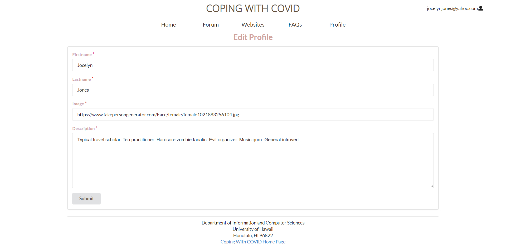
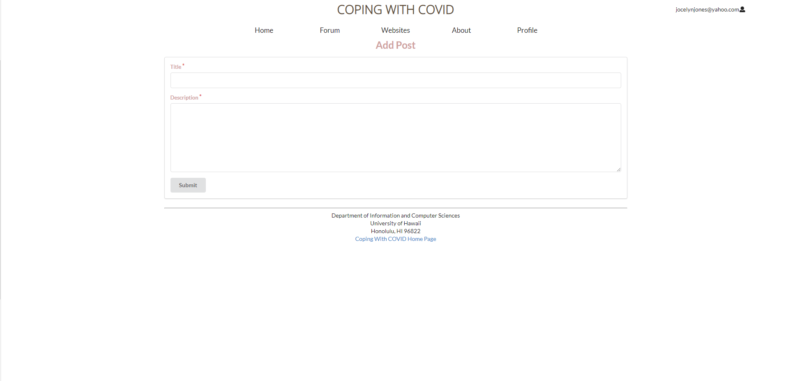
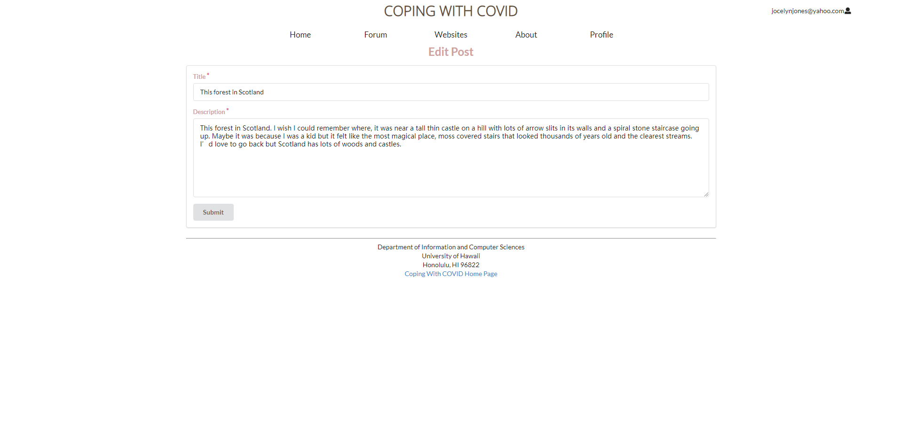
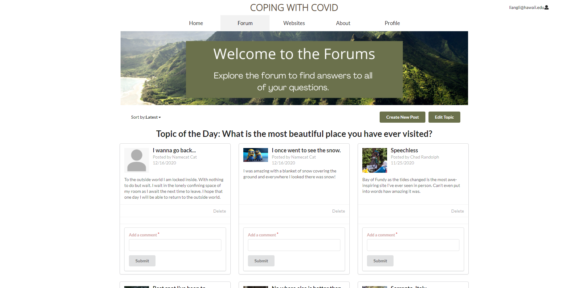
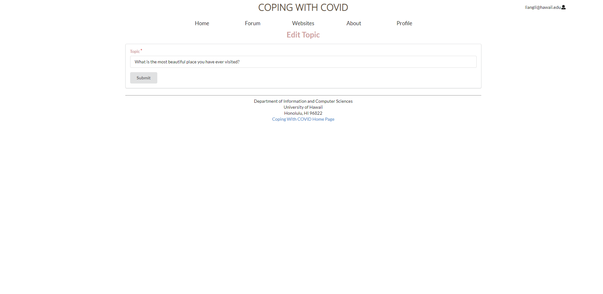
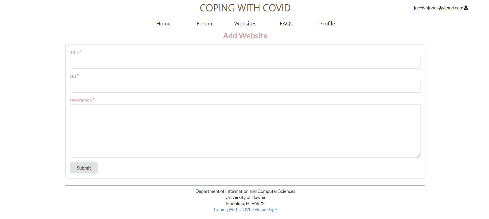
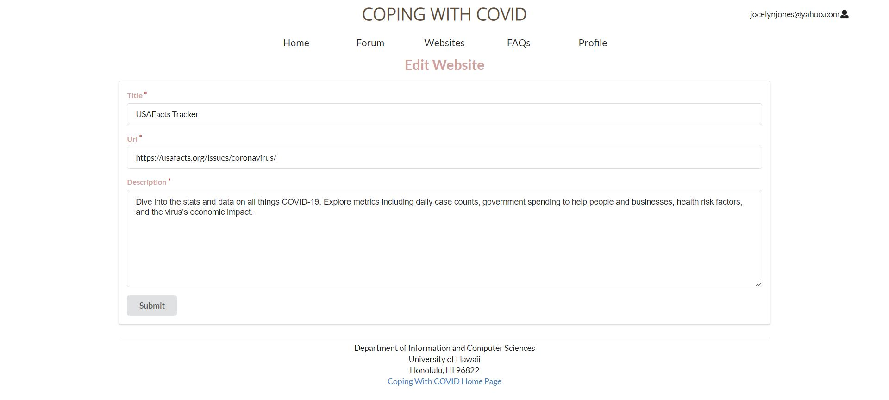
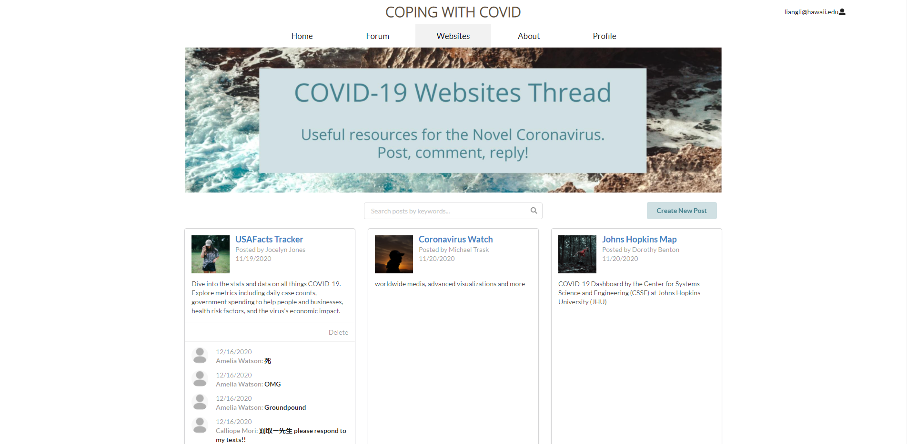
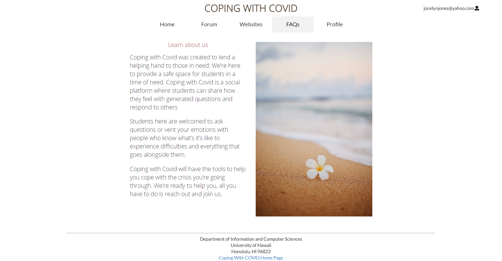

## Table of contents

* [Overview](#overview)
* [Approach](#approach)
* [Use case ideas](#use-case-ideas)
* [Development History](#development-history)
* [User Guide](#user-guide)
* [Community Feedback](#community-feedback)
* [More Advanced Ideas](#more-advanced-ideas)
* [Developer guide](#developer-guide)
* [Deployment](#deployment)
* [Team Members](#team-members)

## Overview

Problem: Student mental health in higher education has been an increasing concern. The COVID-19 pandemic has negatively affected everybody, causing a lot of pressure, uneasiness, despondency, and inner issues for the understudies alongside their companions and their family.

Solution: We propose to create a mental health chat bot that can give students ease and comfort. Making therapy and relief accessible to all. It will be a safe space where people can openly express themselves without fear of judgment.

## Approach

We want to help students reach out during the COVID-19 pandemic and to cope with the distressing issues they are facing. Students will use the site to vent/talk about their day. To accomplish this, our site would suggest a daily topic and users could discuss and share their thoughts around the topic for the day. We would identify keywords students uses in their post and sent out automatic replies that suggest articles or videos that would help comfort the student and make them feel better.

- Daily discussion Page
- User home page
- FAQ page
- Admin home page
- User profile page

## Use case ideas

- New user goes to landing page, logs in, gets home page, sets up profile.
- The Admin goes to landing page, logs in, gets home page, can edit site and update posts.
- User goes to landing page, logs in, get to home page and goes to Daily Discussion Page to post posts.

## Development History

### Initial Idea

Our original idea for the site was to develop a chat bot that could chat and comfort the user.
How the bot would work would be:

- the bot will prompt a topic for conversation.
  - Ex: “ Pineapple on Pizza? Yay! Or Nay?
- Using follow-ups to facilitate responses.
  - The chat bot will identify keywords students use to suggest articles or videos on how to help comfort the student better.

We decided against the chat bot, because we do not have the skill to make the chat bot be interactive enough that it feels "human". The chat function would be too simple and robotic for the user to feel comfort, which defeats the purpose.

### <a href="https://github.com/coping-with-covid/coping-with-covid/projects/1">Milestone 1</a>

- Deployed project to digit ocean


- Inspect MongoDB


- Monitoring the application performance


- Mockup pages

- Active pages

[Landing Page](https://copingwithpandemic.xyz/#/)

[Sign In Page](https://copingwithpandemic.xyz/#/signin)

[Sign Up Page](https://copingwithpandemic.xyz/#/signup)

[Profile Page](https://copingwithpandemic.xyz/#/profile/)

[Edit Profile Page](https://copingwithpandemic.xyz/#/editprofile/)

### <a href="https://github.com/coping-with-covid/coping-with-covid/projects/3">Milestone 2</a>

- [Landing Page](https://copingwithpandemic.xyz/#/)

- [Signin Page](https://copingwithpandemic.xyz/#/signin)

- [SignUp Page](https://copingwithpandemic.xyz/#/signup)

- [Home Page](https://copingwithpandemic.xyz/#/home)

- [Websites Page](https://copingwithpandemic.xyz/#/websites)

- [Add Website](https://copingwithpandemic.xyz/#/addsite)

- [Edit Website](https://copingwithpandemic.xyz/#/editsite/)

- [FAQ Page](https://copingwithpandemic.xyz/#/about)

- [Profile](https://copingwithpandemic.xyz/#/profile/Sg2vf2YfpyrvXyQu6)

- [Update Profile](https://copingwithpandemic.xyz/#/editprofile/)

### <a href="https://github.com/coping-with-covid/coping-with-covid/projects/5">Milestone 3</a>

- [Landing Page](https://copingwithpandemic.xyz/#/)

- [Signin Page](https://copingwithpandemic.xyz/#/signin)

- [SignUp Page](https://copingwithpandemic.xyz/#/signup)

- [Home Page](https://copingwithpandemic.xyz/#/home)

- [Forum Page](https://copingwithpandemic.xyz/#/websites)

- [Websites Page](https://copingwithpandemic.xyz/#/websites)

- [Add Post](https://copingwithpandemic.xyz/#/addpost)

- [Edit Post](https://copingwithpandemic.xyz/#/editpost/)

- [Edit Topic](https://copingwithpandemic.xyz/#/edittopic/)

- [Add Website](https://copingwithpandemic.xyz/#/addsite)

- [Edit Website](https://copingwithpandemic.xyz/#/editsite/)

- [FAQ Page](https://copingwithpandemic.xyz/#/about)

- [Profile](https://copingwithpandemic.xyz/#/profile/Sg2vf2YfpyrvXyQu6)

- [Update Profile](https://copingwithpandemic.xyz/#/editprofile/)


## User Guide
This section provides guidelines on how to use the features in our website

### Landing page

This is the initial page when you get into the website, you can see our introduction of the project and some details. We also have the login and signup option, you can start with register for an account and login.


### Login and Signup

Click the Register button in the home page if you don't have an account. You will need to enter your name, email address and the password to register for the registration.


Alternatively, you can select “Login” to go to the following page and log in to your account.


### Home page

After logging in, you are taken to the home page.


### Profile Page

You can view your profile page after logging in. The page contains your info and all your posts.


You can update your profile by clicking 'Update Info'.


### Forum Page

You can view forum page after logging in. The page contains posts from users and students related to the topic question. Student can feel free to share their feelings and stories on this page. We also set up a sorting option which can help users find the newest and oldest post. We have a comment area under each post; users can leave a comment for posts they like. The comment will also contain a link to your profile page. 


Too add a post, click on 'Create New Post'.


To edit your website post, click on 'Edit' on your post.


As an administrator, you have access to change the topic of the forum page by clicking on 'Edit Topic' and delete posts.



### Websites Page

You can view the websites forum page after logging in. The page contains website posts related to COVID & student health from users. We also have a search bar for the user to search for websites with keywords. Clicking on the post title will bring you to the linked website. Clicking on the user will bring you to their profile page. You can add a comment to each post by clicking 'Submit'. The comment will also contain a link to your profile page.


To add a website post, click on 'Create New Post'.


To edit your website post, click on 'Edit' on your post.


As an administrator, you have access to delete posts.


### About Us Page



## Community Feedback

Although we had positive reviews with the application it self. Users picked up minor thinfgs we could improve on such as
  - Deleting the note submitted pop up after posting a comment
  - Having Learn about us in a bigger font or underlines
  -  Adding a space between the colon and filter when shorting posts
  - https://coping-with-covid.github.io/ <- this page should probably also be on the same page as "Learn About Us"
  
There’s no way around it: the world is really scary right now. As Coronavirus is sweeping the globe as a pandemic, we’re all afraid for the health of ourselves and our loved ones. We went around and ask for a review regarding our application. Although everyone had their own opinion on the page itself regarding the page aesthetic. The most common conclusion all the reviews came up with is that they enjoy the application, even though those who are not seeking support during the time of covid deems that the application is useful as it allows users to go to a webpage where covid facts are stated. And for those seeking support they enjoy the simplicity of the page and how they could distract them self with topics such as travel. 


## More Advanced Ideas

We are unsure how this can be implemented but down below is ideas we hope can improve the app:
  - Direct access to professionals that can assist student’s mental state
    - It be cool with this could somehow connect with UH’s counseling center
  - Somehow per user have old messages saved. So user can look back at them.
  - Daily check in
    - Ex: Mood Tracker, but there can be a calender will user can see logged mood.

## Developer Guide

This section provides information of interest to Meteor developers wishing to use this code base as a basis for their own development tasks.

### Installation

First, [install Meteor](https://www.meteor.com/install).

Second, visit the [Coping-With-Covid](https://coping-with-covid.github.io/), and download the sources as a zip file or make a fork of the repo.  However you do it, download a copy of the repo to your local computer.

Third, cd into the coping-with-covid/app directory and install libraries with:

```
$ meteor npm install
```

Fourth, run the system with:

```
$ meteor npm run start
```

If all goes well, the application will appear at [http://localhost:3000](http://localhost:3000).

### Initialization

To reset all the system and resore all the default data, run
 ```
 $ meteor reset
 ```

### ESLint

To make sure that the system don't have any ESLint error. we can invoke ESLint from the command line as follows:

```
meteor npm run lint
```

Here is sample output indicating that no ESLint errors were detected:

```
$ meteor npm run lint

> Coping-With-Covid@ lint /Users/RayLi/github/Coping-With-Covid/app
> eslint --quiet --ext .jsx --ext .js ./imports ./tests

$
```

ESLint should run without generating any errors.

It's significantly easier to do development with ESLint integrated directly into your IDE (such as IntelliJ).


## Deployment

- <a href="https://copingwithpandemic.xyz/#/">Coping with COVID Landing page</a>

- <a href="https://github.com/coping-with-covid/coping-with-covid/projects/1">Milestone 1 page</a>

- <a href="https://github.com/coping-with-covid/coping-with-covid/projects/3">Milestone 2 page</a>

- <a href="https://github.com/coping-with-covid/coping-with-covid/projects/5">Milestone 3 page</a>


## Team Members
- Chris Dang

Email: cdang808@hawaii.edu
- Chak Hon Lam

Email: chakhon@hawaii.edu
- Guanhong Li

Email: guanhong@hawaii.edu
- Li Liang

Email: liangli@hawaii.edu
