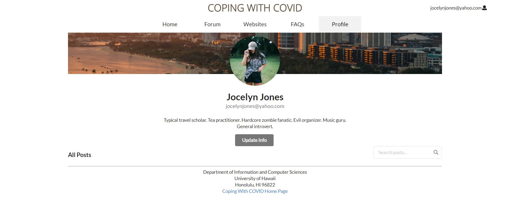

## Table of contents

* [Team Members](#team-members)
* [Overview](#overview)
* [Approach](#approach)
* [Use case ideas](#use-case-ideas)
* [Development History](#development-history)
* [User Guide](#user-guide)
* [More Advanced Ideas](#more-advanced-ideas)
* [Developer guide](#developer-guide)
* [Contact Us](#contact-us)

## Related URLs

- <a href="https://copingwithpandemic.xyz/#/">Deployment of the project</a>

- <a href="https://github.com/coping-with-covid">GitHub organization for the project</a>

- <a href="http://143.110.232.78/#/">Coping with COVID Landing page</a>

- <a href="https://github.com/coping-with-covid/coping-with-covid/projects/1">Milestone 1 page</a>

- <a href="https://github.com/coping-with-covid/coping-with-covid/projects/3">Milestone 2 page</a>

- <a href="https://github.com/coping-with-covid/coping-with-covid/projects/4">Milestone 3 page</a>

## Team Members

- Chris Dang
- Chak Hon Lam
- Guanhong Li
- Li Liang

## Overview

Problem: Student mental health in higher education has been an increasing concern. The COVID-19 pandemic has negatively affected everybody, causing a lot of pressure, uneasiness, despondency, and inner issues for the understudies alongside their companions and their family.

Solution: We propose to create a mental health chat bot that can give students ease and comfort. Making therapy and relief accessible to all. It will be a safe space where people can openly express themselves without fear of judgment.

## Approach

We want to help students reach out during the COVID-19 pandemic and to cope with the distressing issues they are facing. Students will use the site to vent/talk about their day. To accomplish this, our site would suggest a daily topic and users could discuss and share their thoughts around the topic for the day. We would identify keywords students uses in their post and sent out automatic replies that suggest articles or videos that would help comfort the student and make them feel better.

- Daily discussion Page
- User home page
- FAQ page
- Admin home page
- User profile page

## Use case ideas

- New user goes to landing page, logs in, gets home page, sets up profile.
- The Admin goes to landing page, logs in, gets home page, can edit site and update posts.
- User goes to landing page, logs in, get to home page and goes to Daily Discussion Page to post posts.

## Development History

### Inital Idea

Our original idea for the site was to develop a chat bot that could chat and comfort the user.
How the bot would work would be:

- the bot will prompt a topic for conversation.
  - Ex: “ Pineapple on Pizza? Yay! Or Nay?
- Using follow-ups to facilitate responses.
  - The chat bot will identify keywords students use to suggest articles or videos on how to help comfort the student better.

We decided against the chat bot, because we do not have the skill to make the chat bot be interactive enough that it feels "human". The chat function would be too simple and robotic for the user to feel comfort, which defeats the purpose.

### Milestone 1

- Deployed project to digit ocean

<a href="http://143.110.232.78/#/">Coping with COVID Landing page</a>

- Inspect MongoDB


- Monitoring the application performance


- Mockup pages


- Active pages
[Landing Page](http://143.110.232.78/#/)


[Sign In Page](http://143.110.232.78/#/signin)


[Sign Up Page](http://143.110.232.78/#/signup)


[Profile Page](http://143.110.232.78/#/profile)


[Edit Profile Page](http://143.110.232.78/#/profile)


### Milestone 2

- [Lnding Page](https://copingwithpandemic.xyz/#/)


- [Signin Page](https://copingwithpandemic.xyz/#/signin)


- [SignUp Page](https://copingwithpandemic.xyz/#/signup)


- [Home Page]()

- [Forum Page]()

- [COVID-19 Website](https://copingwithpandemic.xyz/#/websites)


- [FAQ Page]()


- [Profile](https://copingwithpandemic.xyz/#/profile/)


- [Updata Profile](https://copingwithpandemic.xyz/#/editprofile/)


## User Guide


## More Advanced Ideas

We are unsure how this can be implemented but down below is ideas we hope can improve the app:
  - Direct access to professionals that can assist student’s mental state
    - It be cool with this could somehow connect with UH’s counseling center
  - Somehow per user have old messages saved. So user can look back at them.
  - Daily check in
    - Ex: Mood Tracker, but there can be a calender will user can see logged mood.

## Developer Guide

This section provides information of interest to Meteor developers wishing to use this code base as a basis for their own development tasks.

### Installation

First, [install Meteor](https://www.meteor.com/install).

Second, visit the [Bowfolios application github page](https://github.com/bowfolios/bowfolios), and click the "Use this template" button to create your own repository initialized with a copy of this application. Alternatively, you can download the sources as a zip file or make a fork of the repo.  However you do it, download a copy of the repo to your local computer.

Third, cd into the bowfolios/app directory and install libraries with:

```
$ meteor npm install
```

Fourth, run the system with:

```
$ meteor npm run start
```

If all goes well, the application will appear at [http://localhost:3000](http://localhost:3000).

### Application Design

Bowfolios is based upon [meteor-application-template-react](https://ics-software-engineering.github.io/meteor-application-template-react/) and [meteor-example-form-react](https://ics-software-engineering.github.io/meteor-example-form-react/). Please use the videos and documentation at those sites to better acquaint yourself with the basic application design and form processing in Bowfolios.

### Data model

As noted above, the Bowfolios data model consists of three "primary" collections (Projects, Profiles, and Interests), as well as three "join" Collections (ProfilesProjects, ProfilesInterests, and ProjectsInterests).  To understand this design choice, consider the situation where you want to specify the projects associated with a Profile.

Design choice #1: Provide a field in Profile collection called "Projects", and fill it with an array of project names. This choice works great when you want to display a Profile and indicate the Projects it's associated with.  But what if you want to go the other direction: display a Project and all of the Profiles associated with it?  Then you have to do a sequential search through all of the Profiles, then do a sequential search through that array field looking for a match.  That's computationally expensive and also just silly.

Design choice #2:  Provide a "join" collection where each document contains two fields: Profile name and Project name. Each entry indicates that there is a relationship between those two entities. Now, to find all the Projects associated with a Profile, just search this collection for all the documents that match the Profile, then extract the Project field. Going the other way is just as easy: to find all the Profiles associated with a Project, just search the collection for all documents matching the Project, then extract the Profile field.

Bowfolios implements Design choice #2 to provide pair-wise relations between all three of its primary collections:


The fields in boldface (Email for Profiles, and Name for Projects and Interests) indicate that those fields must have unique values so that they can be used as a primary key for that collection. This constraint is enforced in the schema definition associated with that collection.


## Initialization

The [config](https://github.com/bowfolios/bowfolios/tree/master/config) directory is intended to hold settings files.  The repository contains one file: [config/settings.development.json](https://github.com/bowfolios/bowfolios/blob/master/config/settings.development.json).

This file contains default definitions for Profiles, Projects, and Interests and the relationships between them. Consult the walkthrough video for more details.

The settings.development.json file contains a field called "loadAssetsFile". It is set to false, but if you change it to true, then the data in the file app/private/data.json will also be loaded.  The code to do this illustrates how to initialize a system when the initial data exceeds the size limitations for the settings file.


### Quality Assurance

#### ESLint

BowFolios includes a [.eslintrc](https://github.com/bowfolios/bowfolios/blob/master/app/.eslintrc) file to define the coding style adhered to in this application. You can invoke ESLint from the command line as follows:

```
meteor npm run lint
```

Here is sample output indicating that no ESLint errors were detected:

```
$ meteor npm run lint

> bowfolios@ lint /Users/philipjohnson/github/bowfolios/bowfolios/app
> eslint --quiet --ext .jsx --ext .js ./imports ./tests

$
```

ESLint should run without generating any errors.

It's significantly easier to do development with ESLint integrated directly into your IDE (such as IntelliJ).

#### End to End Testing

BowFolios uses [TestCafe](https://devexpress.github.io/testcafe/) to provide automated end-to-end testing.

The BowFolios end-to-end test code employs the page object model design pattern.  In the [bowfolios tests/ directory](https://github.com/bowfolios/bowfolios/tree/master/app/tests), the file [tests.testcafe.js](https://github.com/bowfolios/bowfolios/blob/master/app/tests/tests.testcafe.js) contains the TestCafe test definitions. The remaining files in the directory contain "page object models" for the various pages in the system (i.e. Home, Landing, Interests, etc.) as well as one component (navbar). This organization makes the test code shorter, easier to understand, and easier to debug.

To run the end-to-end tests in development mode, you must first start up a BowFolios instance by invoking `meteor npm run start` in one console window.

Then, in another console window, start up the end-to-end tests with:

```
meteor npm run testcafe
```

You will see browser windows appear and disappear as the tests run.  If the tests finish successfully, you should see the following in your second console window:

```
$ meteor npm run testcafe

> bowfolios@ testcafe /Users/philipjohnson/github/bowfolios/bowfolios/app
> testcafe chrome tests/*.testcafe.js

 Running tests in:
 - Chrome 86.0.4240.111 / macOS 10.15.7

 Bowfolios localhost test with default db
 ✓ Test that landing page shows up
 ✓ Test that signin and signout work
 ✓ Test that signup page, then logout works
 ✓ Test that profiles page displays
 ✓ Test that interests page displays
 ✓ Test that projects page displays
 ✓ Test that home page display and profile modification works
 ✓ Test that addProject page works
 ✓ Test that filter page works


 9 passed (40s)

 $
```

You can also run the testcafe tests in "continuous integration mode".  This mode is appropriate when you want to run the tests using a continuous integration service like Jenkins, Semaphore, CircleCI, etc.  In this case, it is problematic to already have the server running in a separate console, and you cannot have the browser window appear and disappear.

To run the testcafe tests in continuous integration mode, first ensure that BowFolios is not running in any console.

Then, invoke `meteor npm run testcafe-ci`.  You will not see any windows appear.  When the tests finish, the console should look like this:

```
$ meteor npm run testcafe-ci

> bowfolios@ testcafe-ci /Users/philipjohnson/github/bowfolios/bowfolios/app
> testcafe chrome:headless tests/*.testcafe.js -q --app "meteor npm run start"

 Running tests in:
 - Chrome 86.0.4240.111 / macOS 10.15.7

 Bowfolios localhost test with default db
 ✓ Test that landing page shows up (unstable)
 ✓ Test that signin and signout work
 ✓ Test that signup page, then logout works
 ✓ Test that profiles page displays
 ✓ Test that interests page displays
 ✓ Test that projects page displays
 ✓ Test that home page display and profile modification works
 ✓ Test that addProject page works
 ✓ Test that filter page works


 9 passed (56s)

$
```

All the tests pass, but the first test is marked as "unstable". At the time of writing, TestCafe fails the first time it tries to run a test in this mode, but subsequent attempts run normally. To prevent the test run from failing due to this problem with TestCafe, we enable [testcafe quarantine mode](https://devexpress.github.io/testcafe/documentation/guides/basic-guides/run-tests.html#quarantine-mode).

The only impact of quarantine mode should be that the first test is marked as "unstable".


## Contact Us
- Chris Dang

Email: cdang808@hawaii.edu
- Chak Hon Lam

Email: chakhon@hawaii.edu
- Guanhong Li

Email: guanhong@hawaii.edu
- Li Liang

Email: liangli@hawaii.edu
